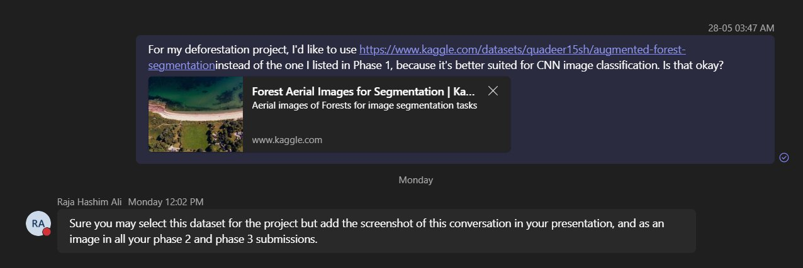

# Deforestation Monitoring Using Deep Learning

**A CNN-Based Forest / Non-Forest Classification of Aerial Imagery**

| | |
|---|---|
| **Student** | Alok Prakashbhai Kevadiya |
| **Field** | Remote Sensing and Satellite Image Analysis |
| **Course** | Machine Learning — Phase 2 |
| **Institution** | University of Europe for Applied Sciences |

---

## Overview

This project applies Convolutional Neural Networks (CNNs) to aerial imagery to classify land as
**Forest** or **Non-Forest** — the foundational capability for automated deforestation monitoring.
A custom CNN built from scratch is compared against a **MobileNetV2 transfer-learning** model.

## Dataset

**Forest Aerial Images for Segmentation** (instructor-approved)
🔗 https://www.kaggle.com/datasets/quadeer15sh/augmented-forest-segmentation

The dataset was originally published for **semantic segmentation** (each image has a forest mask).
For this classification project, each image is labelled **Forest** / **Non-Forest** based on the
fraction of forest pixels in its mask (threshold = 0.5). This adaptation is implemented in the notebook
and documented in the proposal.

> ✅ **Instructor approval:** The use of this dataset was approved by the course instructor,
> Raja Hashim Ali, on Microsoft Teams. The approval screenshot is included in this repository
> (`instructor_approval.png`) and in the proposal document, as required for all Phase 2 and Phase 3
> submissions.



## Repository Structure

```
.
├── deforestation_cnn.ipynb              # Main notebook (Kaggle-ready)
├── deforestation_cnn.py                 # Standalone Python script version
├── Phase2_Proposal_Alok_Kevadiya.docx   # Full proposal document
├── instructor_approval.png              # Instructor dataset-approval screenshot
├── requirements.txt                     # Python dependencies
├── figures/                             # Output figures (generated when run)
└── README.md
```

## How to Run

### Option A — Kaggle (recommended)

1. Open a new Kaggle Notebook and upload `deforestation_cnn.ipynb`.
2. Click **Add Input** → search **"Forest Aerial Images for Segmentation"** by *quadeer15sh* → attach it.
3. Enable **GPU** under *Settings → Accelerator* for faster training.
4. **Run All**. The notebook auto-detects the dataset path under `/kaggle/input/`.

### Option B — Local

```bash
pip install -r requirements.txt
# Download the dataset from the Kaggle link above, then set
# images_dir and masks_dir in the notebook/script to your local paths.
jupyter notebook deforestation_cnn.ipynb     # or:  python deforestation_cnn.py
```

## Pipeline

The implementation covers every required element:

- Dataset loading and label generation (segmentation → classification)
- Image resizing (128×128) and normalization ([0, 1])
- Stratified train / validation / test split (70 / 15 / 15)
- Data augmentation (flips, rotation, zoom, translation)
- Custom CNN model (3 conv blocks + dense head)
- Model training with early stopping and checkpointing
- Evaluation: confusion matrix, classification report, accuracy/loss curves
- Comparison with a transfer-learning model (**MobileNetV2**)
- ROC curves and AUC
- Model comparison table
- **Grad-CAM** visualizations
- **Error analysis** of misclassified samples
- All figures saved to `figures/`

## Output Figures

| File | Description |
|------|-------------|
| `01_class_distribution.png` | Class balance |
| `02_sample_images.png` | Sample Forest / Non-Forest images |
| `03_augmentation_examples.png` | Augmentation preview |
| `04_custom_cnn_curves.png` | Custom CNN accuracy/loss |
| `05a/05b_*` | Custom CNN confusion matrix & ROC |
| `06_transfer_curves.png` | MobileNetV2 accuracy/loss |
| `07a/07b_*` | MobileNetV2 confusion matrix & ROC |
| `08_model_comparison_table.png` | Side-by-side metrics |
| `09_roc_comparison.png` | Combined ROC |
| `10_gradcam.png` | Grad-CAM heatmaps |
| `11_error_analysis.png` | Misclassified examples |

## Frameworks

TensorFlow / Keras, scikit-learn, OpenCV, Matplotlib, Pandas, NumPy.
